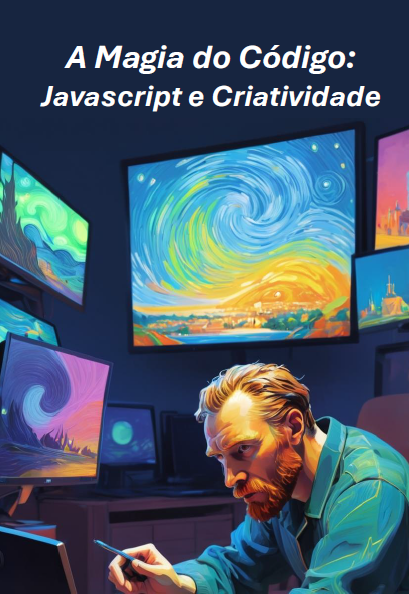

    

-------

# Projeto EBOOK Gerado por I.A.s

 > ℹ️ **NOTE:** Este é o repositório desenvolvido durante o curso no qual fui aluna na plataforma da [DIO](https://dio.me)

Projeto com o objetivo de gerar um ebook digital com as facilidades das ferramentas de IA. todos os prompts
seguem abaixo.

<a href="https://github.com/AnnaMirand4/prompts-recipe-to-create-a-ebook/blob/main/output/ebookJs.pdf" title="View PDF now"> 📕Clique aqui para ler</a>

## 💻 Tecnologias utilizadas no projeto

- [ChatGPT](https://chat.openai.com/) 
- [Leonardo AI](https://leonardo.ai/)
- [PowerPoint](https://www.microsoft.com/en/microsoft-365/powerpoint)

## 🧠 Prompts

ChatGPT：

|   Ação   | prompt                                                                                                                                                                                                                                                                         |
| :------: | ------------------------------------------------------------------------------------------------------------------------------------------------------------------------------------------------------------------------------------------------------------------------------ |
|  título  | Me um titulo de ebook sobre o tema "programação criativa com Javascript" , me dê opções de titulo que utilizem referências do mundo da arte e cultura pop                                                        |
| conteúdo | Me ajude a escrever um ebook em que o conteúdo seja sobre programação criativa com Javascript, fale um pouco sobre como é feito, exemplos, fale sobre artistas conhecidos que usam JS para criar suas peças visuais, fale das possibilidades nessa área. |

Leonardo AI：

|  Ação  | prompt                                                                                 |
| :----: | -------------------------------------------------------------------------------------- |
| título | "Create a digital artwork featuring Vincent van Gogh sitting in front of a computer, engaging in creative programming with JavaScript. On the computer screen, display a masterpiece made from lines of code. Van Gogh should be depicted with his characteristic style and vibrant colors, blending the worlds of traditional art and modern technology." |

## ✨ Features

- Conteúdo gerado via ChatGPT
- Imagens geradas via Leonardo AI

## 📚 Materiais

- Imagens utilizadas em `assets`
- ebook gerado durante as aulas em `output`

---

⌨️ com 💜 por [Anna Miranda](https://github.com/AnnaMirand4)
